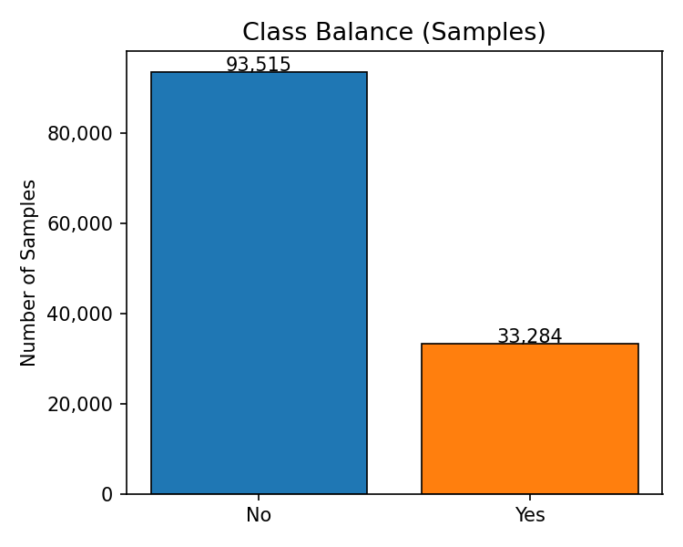
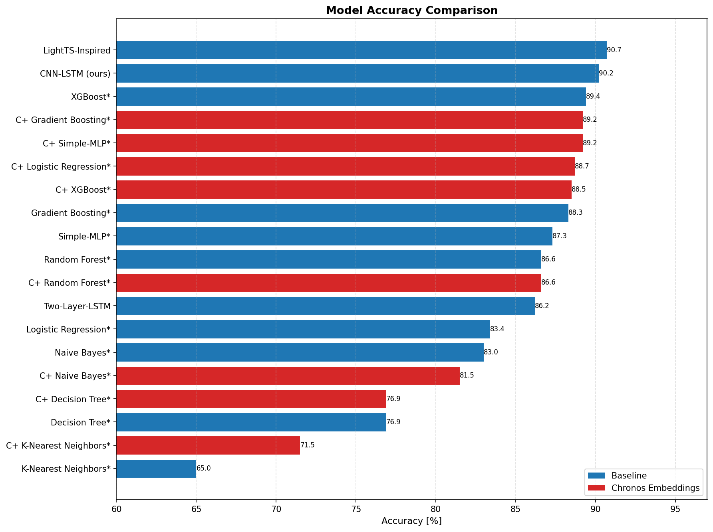
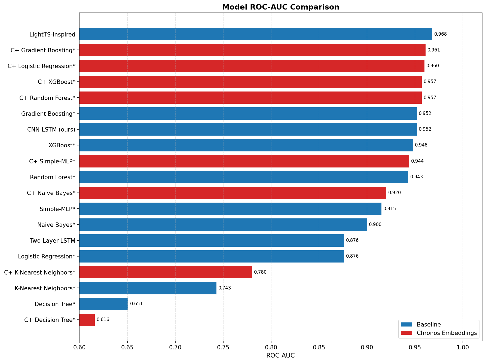

# eco395m-ml-final-project
## Project Overview
The objective of this project is to predict forest fires by replicating a portion of _Spatiotemporal Wildfire Prediction and Reinforcement Learning for Helitack Suppression_. We evaluate eleven models ranging from classical baselines such as Logistic Regression and XGBoost to time-series aware neural architectures, including our proposed CNN-LSTM model. We benchmark each model against accuracy, precision, recall, threshold, F1, ROC-AUC, PR-AUC, and computation time.

Furthermore, we incorporate pretrained Amazon Chronos T5 Mini embeddings to evaluate whether richer temporal representations improve predictive performance over the raw features alone. All of the models are trained on the US Wildfire Dataset (2014-2025) using dstack for cloud-accelerated computation. The results are compared with and without Chronos embeddings across all models.
## Data
### Data Sources
The project analyzes the "US Wildfire Dataset (2014-2025)" found on [kaggle](https://www.kaggle.com/datasets/firecastrl/us-wildfire-dataset/data). The dataset provides information on precipitation, relative humidity, specific humidity, solar radiation, temperatures, wind speed, vapor pressure deficit, fuel moisture indices, energy release component, burning index, and evapotranspiration across 126,800 samples in the continental United States. This data is time series data split into 75 day windows at each coordinate. Each 75 day window comprises of 60 days prior to the event, the ignition/non-ignition day, and the following 14 days. The data includes 50,720 positive (ignition) events, and 76,080 synthesized negative events. 

_Spatiotemporal Wildfire Prediction and Reinforcement Learning for Helitack Suppression,
ICMLA 2025._
### Units & variables

Precipitation (pr): mm/day

Relative humidity (rmax/rmin): %

Specific humidity (sph): kg/kg

Solar radiation (srad): W/m²

Temperatures (tmmn/tmmx): °C

Wind speed (vs): m/s

Vapor pressure deficit (vpd): kPa

Fuel moisture indices (fm100/fm1000): %

Energy release component (erc): index

Burning index (bi): index

Evapotranspiration (etr, pet): mm/day

### Embeddings, Data Collection, and Cleaning
We utilize dstack to accelerate our model training. We are using chronos forecasting with the pretrained Amazon Chronos T5 Mini model to extract feature embeddings. Then using those embeddings as features to improve our model performance. 

### Exploratory Data Analysis
The following visualizations are used to better understand the structure of the dataset and identify any patterns or inconsistencies before modeling. 

### Class Balance 


Reconstructing sample-level labels by grouping the raw data into 75-day 
windows and marking a window as positive if any day within it carries a 
wildfire label, we find approximately 33,284 positive and 93,515 negative 
sequences — a roughly 26/74 split. This differs from the paper's reported 
40/60 split (50,720 positive, 76,080 negative) because the dataset only 
provides a daily Wildfire label column rather than a sequence-level label. 
Some sequences the paper designated as negative may contain days with 
Wildfire = Yes due to nearby or overlapping fire activity, causing our 
reconstruction to overcount positives in non-fire sequences. Regardless 
of the exact split, the imbalance toward non-fire sequences motivated our 
use of weighted cross-entropy loss and threshold tuning rather than 
defaulting to a 0.5 decision boundary.

#### Correlation Matrix


Several features are strongly correlated with one another. The fire behavior metrics including burning index (bi), energy release component (erc), and vapor pressure deficit (vpd) form a tight cluster, suggesting they capture overlapping information about fire-conducive conditions. Fuel moisture measures (fm100, fm1000) are inversely correlated with these fire metrics, consistent with physical expectations. High multicollinearity among these features suggests that dimensionality reduction (such as PCA, as used in our Chronos embedding pipeline) or regularized models may be preferable to naive feature concatenation.

#### Feature Distributions


We plotted the distribution of all 15 weather and fire behavior features separated by wildfire and non-wildfire days. The distributions show that wildfire days tend to have higher values for burning index, energy release component, vapor pressure deficit, and temperature, and lower values for fuel moisture and relative humidity. This makes intuitive sense as hot, dry conditions with low fuel moisture are the physical drivers of wildfire ignition and spread.

#### Temporal Patterns


We examined how six key features trend across the 75-day window for wildfire versus non-wildfire sequences, with the dashed line marking the approximate ignition day around day 60. The most notable finding is that wildfire sequences show persistently more extreme fire weather conditions well before the ignition event occurs, not just on the ignition day itself. Vapor Pressure Deficit and Energy Release Component are consistently elevated for wildfire sequences throughout the entire pre-ignition period, while Fuel Moisture and Min Relative Humidity are persistently lower. Max Temperature runs consistently hotter for wildfire sequences across the full window. Overall this confirms that the 60-day pre-ignition period carries strong predictive signal and motivates the use of time-series aware models that can capture how these conditions evolve over time rather than treating each day independently.

### Data Limitations
The data covers only the continental United States from 2014 to 2025, so results may not generalize to other geographies, fire regimes (e.g. tropical or boreal), or longer climate windows. The dataset also does not include human factors that influence ignition — such as proximity to roads, power lines, or population centers — which are important real-world drivers of wildfire risk. Models trained on this data should therefore be understood as predicting weather and fuel-driven ignition risk specifically, not total wildfire risk.

Additionally, the dataset's 76,080 negative (non-ignition) events are synthesized rather than directly observed, which can affect calibration and the interpretability of false-positive rates in deployment.

The dataset provides only a daily Wildfire label column rather than a sequence-level label, making it impossible to exactly reproduce the paper's reported 40/60 positive/negative split from the raw data alone. Additionally, GRIDMET encodes missing readings with a sentinel value of 32,767.0. These rows were excluded from EDA visualizations but were not removed prior to model training, which may introduce noise for a small number of affected samples.

## Methodology
First, we extracted our wildfire data from Kaggle using the Kaggle API. Then, we conducted a train and test split using a random split to follow the methodology of Spatiotemporal Wildfire Prediction and Reinforcement Learning for Helitack Suppression. From there, we conducted exploratory data analysis, creating visualizations, distributions, and performing basic data cleaning to better understand the structure of the dataset and identify any inconsistencies. In order to train the models, we transformed the data into 75x15 matrices that include prior period, ignition, post period, and model features. This allows us to incorporate both spatial and temporal dynamics of wildfire activity into the modeling framework. Our target variable is defined based on wildfire occurrence/intensity. All predictors are aligned to ensure consistency across time periods. We obtained baseline estimates of the following models: CNN-LSTM, XGBoost, Gradient Boosting, Random Forest, K-Nearest Neighbors, Simple-MLP, Decision Tree, Two-Layer-LSTM, LightTS-Inspired, Logistic Regression, and Naive Bayes. These models were chosen to capture a wide range of relationships in the data, including both linear and nonlinear patterns as well as temporal dependencies.

#### Classical Baseline Models
A logistic regression model is used as a baseline benchmark. This provides a simple and interpretable reference point for evaluating more complex models. However, we expect this model to have limitations due to nonlinear relationships and interactions between environmental and weather-related predictors.

Tree-based models such as Decision Trees, Random Forest, Gradient Boosting, and XGBoost are implemented to capture nonlinear relationships and higher-order interactions between predictors. Random Forest helps reduce variance through averaging across trees. Boosting-based methods like Gradient Boosting and XGBoost iteratively improve model performance by focusing on previous errors. These models are particularly useful given that  wildfire risk may depend on complex combinations of weather and environmental conditions. Since these models are not inherently time-series aware, the 3D sequence tensor is flattened to 1,125 features before modeling, meaning they cannot capture the temporal ordering of the 75-day window.

We also include K-Nearest Neighbors and Naive Bayes as additional benchmarks. KNN captures local similarity in the feature space, while Naive Bayes provides a probabilistic framework under simplifying independence assumptions. These models provide useful comparisons for evaluating more complex approaches.

#### Neural Network Models
We implement several neural network architectures to capture both spatial and temporal dependencies in the data.

- Simple-MLP: A baseline feedforward neural network that captures nonlinear relationships using the same flattened 1,125-dimensional feature vectors as the classical models. This serves as a reference point for what the time-series aware neural models can improve on.
- CNN-LSTM (ours): Combines convolutional layers for local temporal feature extraction with LSTM layers for longer range sequential dependencies. This is our proposed model and we expect it to benefit from both the pattern detection of the CNN and the sequential memory of the LSTM.
- Two-Layer-LSTM: Focuses on sequential dependencies in the data by modeling temporal patterns across multiple periods using two stacked LSTM layers.
- LightTS-Inspired: A lightweight time series model that uses 1D convolutions and global average pooling to efficiently capture temporal structure without the computational overhead of recurrent layers.

These models operate directly on the 3D sequence tensor without flattening and are appropriate to use for structured spatiotemporal data where both location-based and time-based patterns matter. All neural models use a weighted cross-entropy loss to handle class imbalance and are trained with the Adam optimizer.

#### Feature Embeddings with Chronos
After obtaining baseline results, we extracted embeddings using a frozen pretrained Amazon Chronos T5 Mini model. Chronos embeddings summarize temporal patterns into a dense representation, allowing even simple models like logistic regression to capture time-dependent structure without explicitly modeling sequences. Each GRIDMET feature is encoded as a univariate time series, mean-pooled, and concatenated into a flat embedding per sample, then reduced via PCA before classification. The full implementation is in `train/train_table_iii_cloud.py`. We re-ran all baseline classifiers on these embeddings to evaluate whether richer temporal representations improve predictive performance.

#### Model Evaluation
All models are evaluated using the same train/test split to ensure consistency. Predictive performance is measured using accuracy, precision, recall, F1, ROC-AUC, and PR-AUC. Thresholds are tuned on a held-out validation set rather than defaulting to 0.5, which better reflects real-world operating conditions for fire detection. The full results table includes all models with and without Chronos embeddings.

All models were trained together in a single [dstack](https://dstack.ai) cloud job (`train/train_table_iii_cloud.py`) to ensure all results come from the same environment and split. Results are in `output/models_table.txt`.
### Modeling Limitations
The time-based split holds out all sequences from Jan–Apr 2025 for testing. While this aligns with the paper's evaluation period, the resulting test set is small relative to the full dataset, which limits the statistical reliability of the reported metrics.

No systematic hyperparameter tuning was performed. All models use manually chosen parameters, and systematic search — particularly for XGBoost and the neural architectures — would likely improve performance across the board.

Compute constraints limited the number of configurations we could explore. At full scale, Gradient Boosting and Chronos + Gradient Boosting each required over 20 minutes of training time, making iterative experimentation impractical without dedicated cloud resources.
## Results
We evaluated all of the aforementioned models using the same train/test split and measured performance across accuracy, precision, recall, F1, ROC-AUC, and PR-AUC. Model training was accelerated using dstack to ensure efficient computation across our models like Gradient Boosting and CNN-LSTM. The results are posted in a [table](output/models_table.txt), and they are also pasted below:
| Model | Accuracy [%] | Precision | Recall | F1 | Threshold | ROC-AUC | PR-AUC | Seconds |
|-------|-------------|-----------|--------|----|-----------|---------|--------|---------|
| CNN-LSTM (ours) | 90.2 | 0.96 | 0.91 | 0.93 | 0.620 | 0.952 | 0.984 | 63.16 |
| XGBoost* | 89.4 | 0.94 | 0.92 | 0.93 | 0.247 | 0.948 | 0.984 | 25.32 |
| Gradient Boosting* | 88.3 | 0.93 | 0.92 | 0.92 | 0.237 | 0.952 | 0.986 | 2022.51 |
| Random Forest* | 86.6 | 0.95 | 0.87 | 0.91 | 0.253 | 0.943 | 0.981 | 126.12 |
| K-Nearest Neighbors* | 65.0 | 0.90 | 0.62 | 0.73 | 0.400 | 0.743 | 0.886 | 15.87 |
| Simple-MLP* | 87.3 | 0.91 | 0.93 | 0.92 | 0.590 | 0.915 | 0.974 | 22.98 |
| Decision Tree* | 76.9 | 0.77 | 1.00 | 0.87 | 0.000 | 0.651 | 0.834 | 184.21 |
| Two-Layer-LSTM | 86.2 | 0.91 | 0.91 | 0.91 | 0.602 | 0.876 | 0.955 | 48.04 |
| LightTS-Inspired | 90.7 | 0.99 | 0.89 | 0.94 | 0.609 | 0.968 | 0.991 | 31.94 |
| Logistic Regression* | 83.4 | 0.87 | 0.92 | 0.90 | 0.433 | 0.876 | 0.961 | 81.32 |
| Naive Bayes* | 83.0 | 0.98 | 0.79 | 0.88 | 0.000 | 0.900 | 0.973 | 0.83 |
| Chronos + XGBoost* | 88.5 | 0.95 | 0.90 | 0.92 | 0.250 | 0.957 | 0.987 | 5.22 |
| Chronos + Gradient Boosting* | 89.2 | 0.95 | 0.90 | 0.93 | 0.234 | 0.961 | 0.988 | 1316.63 |
| Chronos + Random Forest* | 86.6 | 0.98 | 0.84 | 0.91 | 0.260 | 0.957 | 0.986 | 115.76 |
| Chronos + K-Nearest Neighbors* | 71.5 | 0.88 | 0.73 | 0.80 | 0.400 | 0.780 | 0.910 | 4.66 |
| Chronos + Simple-MLP* | 89.2 | 0.96 | 0.90 | 0.93 | 0.579 | 0.944 | 0.980 | 22.19 |
| Chronos + Decision Tree* | 76.9 | 0.77 | 1.00 | 0.87 | 0.000 | 0.616 | 0.816 | 73.62 |
| Chronos + Logistic Regression* | 88.7 | 0.91 | 0.95 | 0.93 | 0.409 | 0.960 | 0.989 | 3.51 |
| Chronos + Naive Bayes* | 81.5 | 0.98 | 0.78 | 0.87 | 0.194 | 0.920 | 0.977 | 0.26 |

These results indicate that our time-series aware models performed competitively against the classical baselines. The LightTS-Inspired model achieved the highest accuracy at 90.7%, an F1 of 0.94, and the highest PR-AUC of 0.991. Our proposed model, the CNN-LSTM, was the next best model with 90.2% accuracy, an F1 of 0.93, and an ROC-AUC of 0.952. This suggests that explicitly modeling the temporal structure of the 75-day sequences provides real predictive value beyond just simply flattening the features.

On the other hand, XGBoost performed the strongest out of the classical baseline models, with 89.4% accuracy. Gradient Boosting also performed well with a 88.3% accuracy, but with a significantly longer training time of 2022 seconds versus XGBoost's 25 seconds. K-Nearest Neighbors was the weakest baseline at 65.0% accuracy. This finding is not surprising given that distance-based methods tend to scale poorly when dealing with high-dimensional flattened feature vectors.

Regarding the Chronos embedding results, we find that the embedding resulted in modest, but positive improvements across most models, except for the XGBoost and Naive Bayes models. Logistic Regression saw a large improvement, going from 83.4% accurarcy without the embeddings to 88.7% accuracy with the embeddings. This suggests these pretrained temporal representations captured structure that the linear Logistic regression model cannot learn on its own. This shows that pretrained temporal embeddings (Chronos) allow simple models to match the performance of complex time-series architectures, suggesting representation quality may matter more than model complexity. Additionally, the Chronos embeddings also improved KNN from 65.0% accurary to 71.5% accurary. 

Below are the models ranked visually by accuracy and ROC-AUC values:




When making comparisons across the accuracy and ROC-AUC bar charts, we find that the rankings are somewhat consistent. The LightTS-Inspired, CNN-LSTM, and XGBoost models remain at the top of the rankings for both accuracy and ROC-AUC, while K-Nearest Neighbors and Decision Tree remain at the bottom of the rankings. Given the results, it is evident that the LightTS-Inspired model outranked our proposed CNN-LSTM in both metrics, which is noteworthy because LightTS-Inspired is a more parsimonious model. This suggests that, for this dataset, the additional LSTM layers in our model did not translate to better performance despite the increased complexity.

Overall, most models had ROC-AUC scores above 0.90. This indicates that our models are reliably ranking wildfire sequences above non-wildfire sequences across all possible thresholds, not just at the threshold we chose.

## Recommendations
The CNN-LSTM from the paper achieved 90.2% accuracy and a ROC-AUC of 0.952. Chronos + Logistic Regression matched or exceeded this (ROC-AUC 0.960, PR-AUC 0.989) at a fraction of the compute cost, demonstrating that a frozen pretrained encoder paired with a simple classifier can substitute for a purpose-built sequence architecture on this task.

Several extensions could strengthen these results. All models in this project used manually chosen hyperparameters, leaving performance on the table. Bayesian hyperparameter optimization via [Optuna](https://optuna.org) would efficiently search the parameter space without requiring exhaustive grid search — XGBoost and Chronos + LR are particularly good candidates given their fast training times (25s and 3.5s respectively). Experimenting with larger Chronos variants (T5-small or T5-base) could produce richer embeddings, and restricting the Chronos input to the five fire-index features (ERC, BI, VPD, FM100, FM1000) may improve signal quality by removing weather noise. Finally, addressing the synthetic negative events in the dataset and extending the held-out test period beyond four months would improve confidence in the reported metrics.
## Reproduction
Use Python 3.11 and configure a Kaggle API token at `~/.kaggle/kaggle.json`.

1. Clone the repository and install dependencies:

```bash
git clone git@github.com:Williamsillon/eco395m-ml-final-project.git
cd eco395m-ml-final-project
pip install -r train/requirements.txt
```

2. Download the dataset by running `pulldata.py`. This creates `Wildfire_Dataset.csv` in the project root.

3. Run the full pipeline with dstack:

```bash
dstack run . -f train/train-table-iii.dstack.yml
```

4. Or run locally:

```bash
python train/train_table_iii_cloud.py --data-path Wildfire_Dataset.csv --no-download
```

The dstack run saves artifacts to `/mnt/artifacts/table_iii_dstack/`. The final table used in this report is in `output/models_table.txt`.
